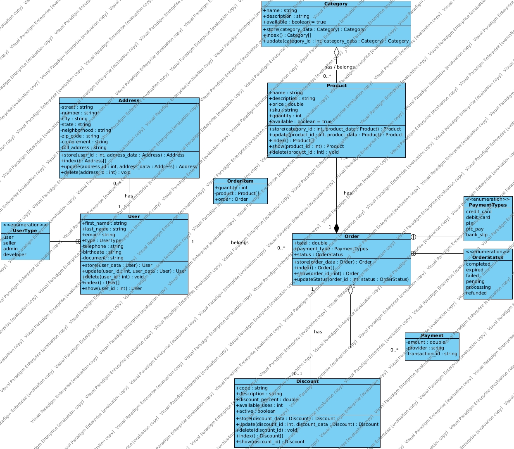

# Projeto Sistema Completo - API E-commerce

Aluno: Nélio Espíndula Junior  
Professora: Gabriela Martins de Jesus  
Turma: CC4N

# E-Commerce API

Este projeto é uma API para um sistema de e-commerce, desenvolvido em ASP.NET Core Web API.



## Requisitos

Certifique-se de ter os seguintes requisitos instalados antes de prosseguir:

- [.NET Core SDK](https://dotnet.microsoft.com/download)
- [PostgreSQL](https://www.postgresql.org/download/)

## Configuração do Banco de Dados

1. Crie um banco de dados no PostgreSQL chamado `api`.
2. Configure as credenciais do banco de dados no arquivo `appsettings.json`.

```json
{
  "ConnectionStrings": {
    "DefaultConnection": "Host=localhost;Database=ecommerce;Username=seu_usuario;Password=sua_senha"
  },
  // ... outras configurações
}
```

# Executando o projeto

1. Abra um terminal na pasta do projeto.
2. Execute os seguintes comandos:

```bash
dotnet restore
dotnet build
dotnet ef database update
dotnet run
```

O projeto será executado em http://localhost:5000.

# Rotas da API

As rotas da API estão disponíveis ao executar o projeto e documentadas em http://localhost:5000/swagger/index.html

# Contribuição

Sinta-se à vontade para contribuir para o projeto. Crie uma branch, faça suas alterações e envie um pull request.